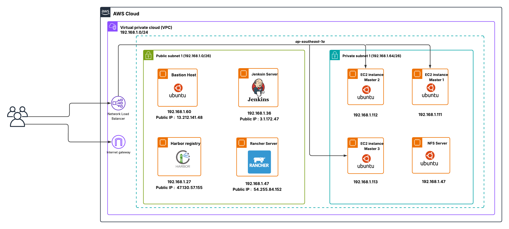
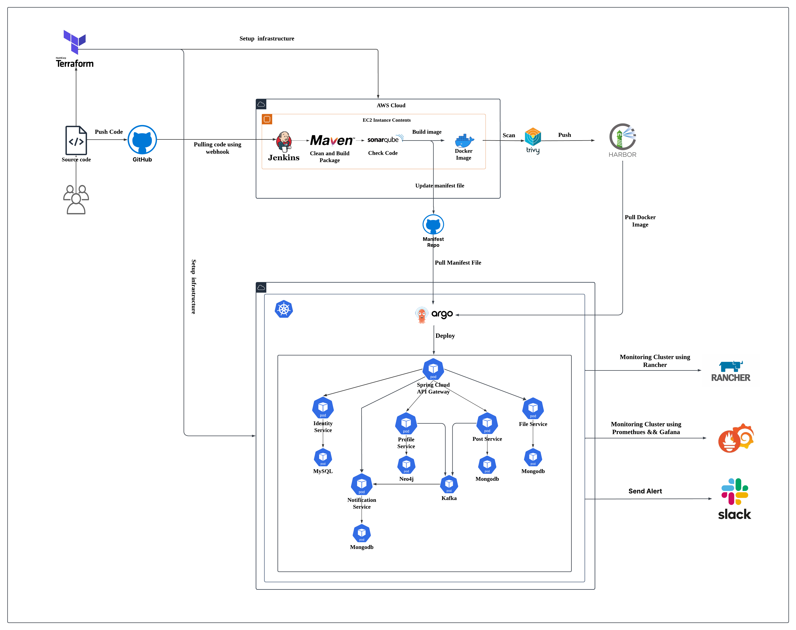

# 📚 Book-Reviews

## 📌 Project Overview  
This project demonstrates a complete DevOps pipeline for deploying a microservices-based application on a self-hosted Kubernetes cluster (provisioned with `kubeadm` on AWS EC2).  
It covers infrastructure provisioning, CI/CD, container security, GitOps deployment, and monitoring.

---

## ⚙️ Technologies Used

- **IaC**: Terraform, Bash  
- **Cloud Platform**: AWS EC2  
- **Containerization & Orchestration**: Docker, Kubernetes (kubeadm), Helm  
- **CI/CD**: Jenkins, GitHub, Argo CD  
- **Security**: Trivy, Harbor  
- **Monitoring**: Prometheus, Grafana, Slack  
- **Microservices**: Spring Boot, Kafka, MongoDB

---

## 🚀 Architecture Overview

- Terraform provisions VPC, EC2 instances, security groups  
- Bash scripts bootstrap a multi-node Kubernetes cluster using `kubeadm`  
- Jenkins builds source code (Maven), runs SonarQube checks, builds Docker images  
- Trivy scans Docker images for vulnerabilities before pushing to Harbor  
- Kubernetes manifests & Helm charts define deployment for each service  
- Argo CD syncs manifests from GitHub to K8s (GitOps)  
- Prometheus & Grafana monitor cluster and app metrics; alerts sent via Slack  
- Spring Boot microservices communicate via Kafka and store data in MongoDB  

---

## 🧭 Architecture Diagram on AWS

## 🔄 CI/CD Workflow

1. ✅ **Developer pushes code** to GitHub repository
2. ⚙️ **Jenkins pipeline** is triggered via webhook
3. 🧪 **Maven** builds the project & **SonarQube** performs code quality analysis
4. 🐳 **Docker** builds container image for each service
5. 🔍 **Trivy** scans the image for vulnerabilities
6. 📦 Image is pushed to **Harbor** (private Docker registry)
7. 🔁 **Argo CD** detects changes and syncs manifests from GitHub to Kubernetes cluster
8. ☸️ **Kubernetes** deploys updated microservices
9. 📊 **Prometheus + Grafana** monitor system metrics
10. 🖥️ Rancher provides a visual dashboard for managing and monitoring Kubernetes workloads and resources
11. 🔔 **Slack** alerts about status of cluster

---

## 🔗 GitOps Repository

- 📁 [book-reviews-gitops](https://github.com/nnhaiNam/book-reviews-gitops.git)  
    _Contains K8s manifests, Ingress, Argo CD configs and Slack alert rules for GitOps deployment._

## 🔗 Terraform Repository
- 📁 [book-reviews-terraform](https://github.com/nnhaiNam/Terraform_K8S_Cluster.git)  
    _Contains Terraform code for provisioning AWS infrastructure including VPC, EC2, security groups, and other resources._
